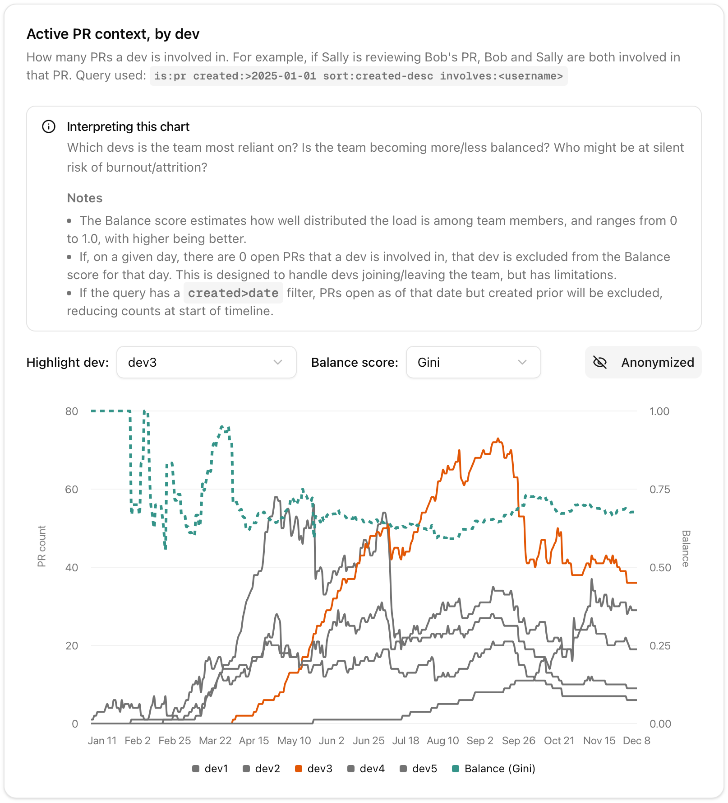
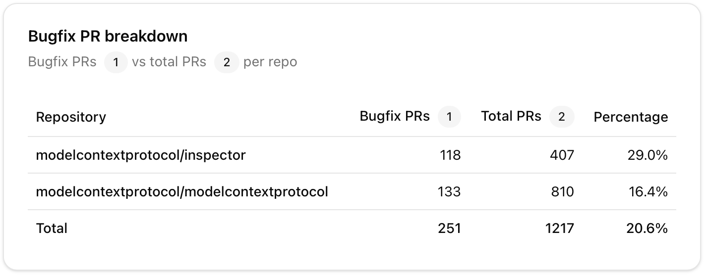
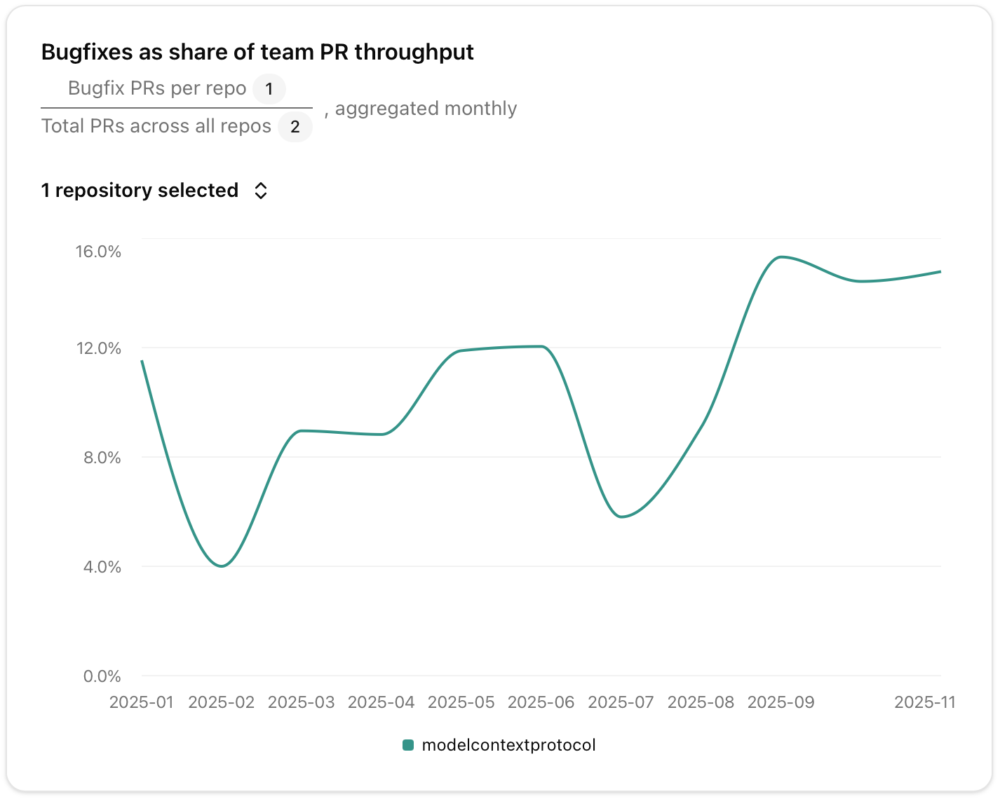
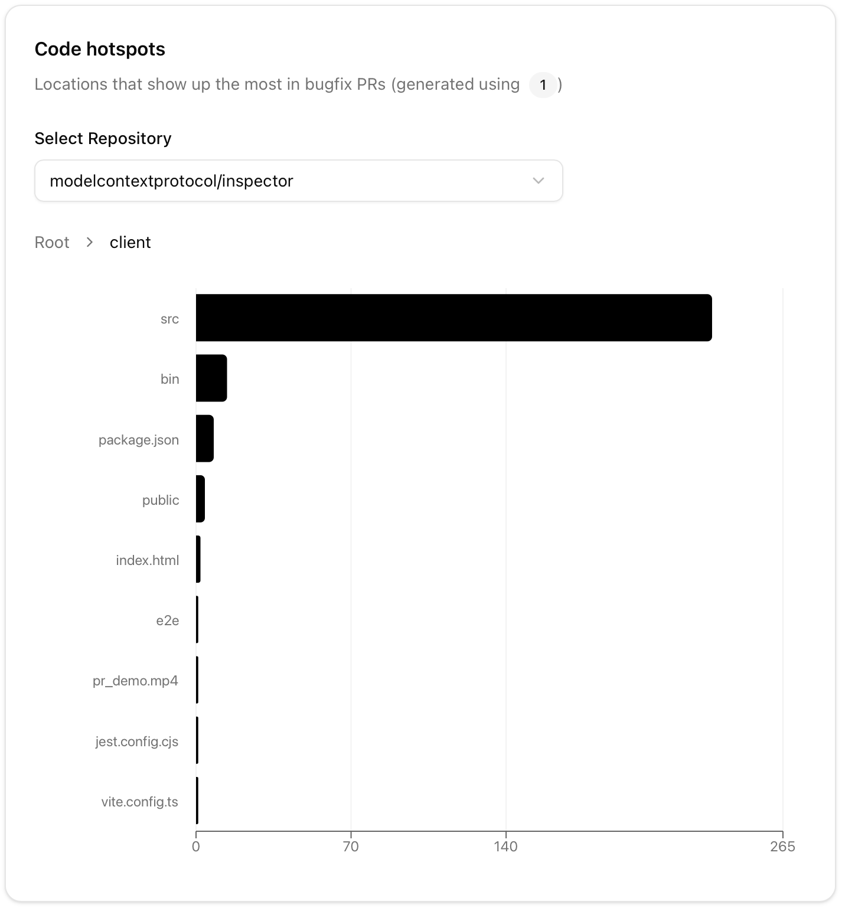

# Quality Triage

Data to help engineering managers answer these questions:
- How reliant is the team on a subset of devs? How often are they in the critical path? If trying to change this, how is progress? 
- Who might be at silent risk of burnout/attrition?
- Which parts of our codebase are costliest to maintain? Which are becoming more costly?
- What areas of code are most brittle? Where should we focus first to reduce regressions?
- Where will we get the highest ROI on reducing tech debt?

## Quickstart

### Installation

1. Clone the repository and install dependencies:

```bash
npm install
```

2. Generate a [GitHub Personal Access Token](https://github.com/settings/personal-access-tokens) with access to the repos you want to analyze.

3. Copy the `.env.example` file and add your GitHub token:

```bash
GITHUB_TOKEN=your_github_personal_access_token
```

4. Run the development server:

```bash
npm run dev
```

5. Open [http://localhost:3000](http://localhost:3000)

### Configuration

On first launch, configure the dashboard for your team:

1. **Repositories** - GitHub repositories your team contributes to
2. **Authors** - GitHub usernames for your devs (e.g. helpful to filter monorepos with multiple teams)
3. **Bugfix Query** - GitHub search query to identify bugfix PRs
- e.g. replace `fix in:title` with `label:bug` if more accurate for your team
- Yes, this query will likely be incomplete
4. **Total PRs Query** - GitHub search query for all PRs created by your team

Configuration is automatically saved to `config.json` for persistence.

## Team Health

### Active PR context, by dev

Which devs is the team most reliant on? Is the team becoming more/less balanced? Who might be at silent risk of burnout/attrition?



## Code Health

### Bugfix PR breakdown

What share of PRs in each repo are bugfixes?



### Bugfixes as share of team PR throughput

Which parts of our codebase are costliest to maintain? Which are becoming more costly?
- The more consistent in size/complexity your PRs, the more useful this metric



### Code hotspots

What areas of code are most brittle? Where should we focus first to reduce regressions?
- Likely more useful for LLM-generated or old code you/your team are less familiar with



## License

This project is licensed under the MIT License - see the [LICENSE](LICENSE) file for details.